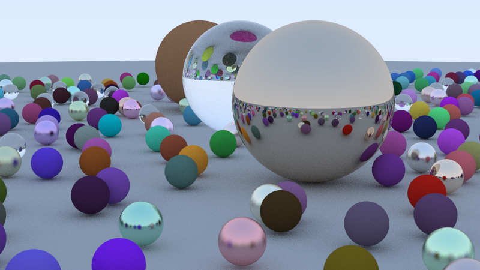

# Stochastic Raytracer

A high-performance C++ raytracer that renders photorealistic scenes with multiple material types including diffuse, metallic, and glass surfaces.



## Features

- **Multi-threaded rendering** for improved performance
- **Multiple material types**: Lambertian (diffuse), metal with configurable roughness, and dielectric (glass)
- **Depth of field effects** with configurable focus distance and aperture
- **Anti-aliasing** through stochastic sampling
- **Realistic lighting** with sky gradient backgrounds

## Building

### Prerequisites
- Visual Studio Build Tools or Visual Studio Community
- C++17 compatible compiler

### Compilation

From a Developer Command Prompt:
```cmd
cl /EHsc /std:c++17 /O2 src\main.cpp /Fe:raytracer.exe
```

Or using CMake:
```cmd
cmake -B build
cmake --build build --config Release
```

## Usage

Run the raytracer to generate a PPM image:
```cmd
raytracer.exe > output.ppm
```

The program will render a scene with randomly distributed spheres of various materials and output the result as a PPM image file.

## Output

The raytracer generates images in PPM format. To view the output:
- Use image editing software like GIMP or Paint.NET
- Convert to common formats (PNG/JPG) using ImageMagick or online converters
- Upload to online PPM viewers

## Scene Configuration

The default scene includes:
- Large ground sphere with diffuse material
- Multiple small spheres with random materials and positions
- Three large spheres showcasing different material types
- Blue sky gradient background

## Performance

The raytracer uses multi-threading to parallelize row rendering, automatically detecting available CPU cores for optimal performance.